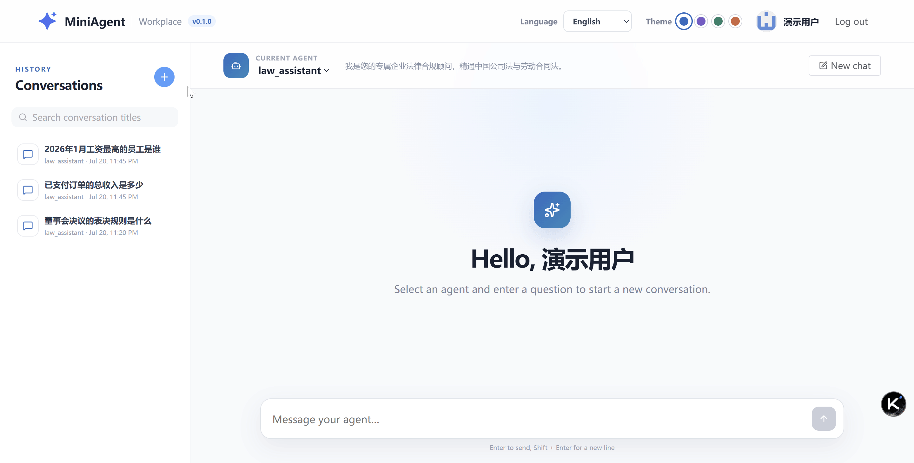
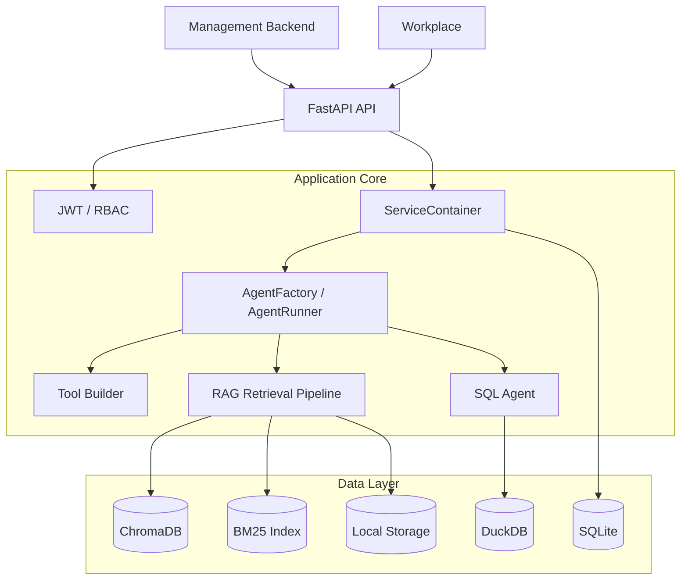

<div align="center">
  

# MiniAgent

A lightweight intelligent agent platform for individuals and small teams.

**Simple architecture · Explicit code · Easy deployment · Easy to extend**


[License](LICENSE) · [API Documentation (after local startup)](http://localhost:10088/docs)

</div>

> [!IMPORTANT]
> MiniAgent is currently under development, and its database structure and interface are subject to change. Please back up `backend/db` and `backend/files` before upgrading.

## Project Introduction

MiniAgent provides a complete workflow from model configuration, knowledge base building, agent orchestration to end-user dialogue. The project includes a FastAPI backend, a PureAdmin management backend, and a separate Workplace user workbench, suitable for building enterprise knowledge assistants, internal data assistants, legal advisors, and other vertical domain agents.




## Core Functions

### Agents and Models

- Create and manage multiple agents, configure system prompts, LLM, and tools
- Support OpenAI compatible interfaces, Ollama and other model services
- Manage LLM, Embeddings, tools, domain plugins, and routing policies
- Control the scope of agent usage based on user-agent authorization relationships
- Support synchronous calls and SSE streaming responses

### RAG Knowledge Base

- Manage multiple knowledge bases, documents, and slices
- Support common document formats such as PDF, Word, text, and tables
- ChromaDB vector retrieval and BM25 keyword retrieval
- Support RRF fusion, threshold filtering, optional reordering, and Small-to-Big retrieval
- Support multi-knowledge base intelligent routing and domain processing plugins

### SQL and Tool Capabilities

- Use DuckDB Analyze structured data such as CSV and Excel
- SQL Agent supports data querying, statistical analysis, and chart generation
- Extensible tool system and Web Search capabilities
- Agent runtime tool caching and configuration invalidation mechanism

### Permissions and Maintenance

- JWT login, automatic Access Token refresh, and RBAC permission control
- Password complexity verification and login failure lockout
- Administrators can unlock users and maintain user agent authorizations
- Login logs, audit logs, and system configuration management
- API, SQLite, DuckDB, and hardware resource status monitoring

### Dual Frontends

- **Management**: System management backend based on PureAdmin
- **Workplace**: Agent workbench for end users
- Login, automatic Token refresh, and logout
- Chinese `zh_CN` and English `en_US`
- Multiple theme colors
- Select authorized agents
- Query, view, rename, and delete sessions
- Markdown messages and SSE streaming conversations

## System Architecture



The backend adopts a clear layered structure:

- `app/api/`: HTTP routing, dependency injection, and request/response transformation

- `app/services/`: Business logic
- `app/runtime/`: Runtime components such as agents, sessions, LLM, and retrieval
- `app/repositories/`: Asynchronous database access
- `app/schemas/`: Pydantic data model
- `app/infra/`: Database model, caching, initialization, and infrastructure

Startup process:

- DB init — app/infra/db/initializer.py creates SQLite tables and loads seed JSON from app/infra/db/seed/
- ServiceContainer — Builds the asynchronous SQLAlchemy engine, all repositories, and long-running services
- Domain plugins — Load domain rows from the database and register knowledge base processors via dynamic import.

All shared resources reside in `request.app.state.container`. Routes retrieve it via `Depends(get_container)`.

## Technology Stack

| Modules | Technologies |
| ---------- | --------------------------------------------------- |
| Backend | Python, FastAPI, Pydantic, SQLAlchemy Async, Loguru |
| Agents | LangChain, Custom Agent Runtime |
| Admin Backend | Vue 3, TypeScript, PureAdmin, Element Plus, Pinia |
| User Workbench | Vue 3, TypeScript, Vite, Element Plus, Vue I18n |
| Business Database | SQLite |
| Analytics Database | DuckDB |
| Vector Database | ChromaDB |
| Search | Vector Search, BM25, RRF, Reranker |

## Directory Structure

```text

miniagent/
├── backend/ # FastAPI Backend
│ ├── app/
│ │ ├── api/ # Admin, User, Auth, Operations Interface
│ │ ├── core/ # Configuration, Security, Dependency Injection, i18n
│ │ ├── infra/ # ORM, Database Initialization, Caching
│ │ ├── repositories/ # Asynchronous Data Access Layer
│ │ ├── runtime/ # Agent, LLM, Session and Runtime Components
│ │ ├── schemas/ # Pydantic DTO
│ │ └── services/ # Business Services
│ ├── db/ # Local Database and Indexes (Generated at Runtime)
│ ├── files/ # Upload Files (Generated at Runtime)
│ ├── .env.example # Environment Variable Template
│ └── requirements.txt
├── management/ # PureAdmin Management Backend
├── workplace/ # End-User Workbench
├── docker-compose.yml
├── setup.bat
├── setup.sh
└── README.md

```

## Environment Requirements

- Python 3.12 or later
- Node.js 20.19+ or 22.13+
- pnpm 9 or later
- Available LLM service, such as Ollama or OpenAI compatible interface
- Optional: NVIDIA GPU and corresponding driver

## Quick Start

### 1. Get the Code

```bash
git clone https://github.com/liupras/miniagent.git
cd miniagent

```

### 2. Configure and Start the Backend

Windows PowerShell:

```powershell
Set-Location backend
py -m venv .venv
.\.venv\Scripts\Activate.ps1
python -m pip install --upgrade pip
python -m pip install -r requirements.txt
Copy-Item .env.example .env

```

Linux/macOS:

```bash
cd backend
python3 -m venv .venv
source .venv/bin/activate
python -m pip install --upgrade pip
python -m pip install -r requirements.txt
cp .env.example .env

```

Open `backend/.env`, at least modify the JWT key, and configure the actual model service to be used. Then start the API:

```bash

python -m uvicorn app.main:app --reload --host 0.0.0.0 --port 10088

```

The application will automatically create the database and load seed data on its first startup.

### 3. Start the Management Backend

Open a new terminal:

```bash
cd management
pnpm install
pnpm dev
```

Default address: <http://localhost:8848>

### 4. Start Workplace

Open another new terminal:

```bash
cd workplace
pnpm install
pnpm dev
```

Workplace uses the Vite development server; the access address is as shown in the terminal output.

> [!TIP]

`pnpm` must be run in the `management` or `workplace` directory. `backend` is a Python project and does not contain a `package.json`.

## Default Development Account

| Purpose | Username | Password |
| ------------------ | ------- | ---------- |
| Administrator | `admin` | `1FaFkWt9` |
| Workplace Demo User | `demo` | `fIzF7JHK` |

The demo user is authorized to use `law_assistant` by default.

> [!WARNING]
> The default account is for local development only. Before deploying to a shared or production environment, you must change the password, replace `JWT_SECRET_KEY`, and check user authorization.

## Commonly Used Addresses

After starting the default development environment:

| Service | Address |
| ---------- | ------------------------------- |
| FastAPI | <http://localhost:10088> |
| Swagger UI | <http://localhost:10088/docs> |
| ReDoc | <http://localhost:10088/redoc> |
| Health Check | <http://localhost:10088/health> |
| Management | <http://localhost:8848> |
| Workplace | Refer to Vite terminal output |

## Key Configurations

Backend configuration is located in `backend/.env`. See `backend/.env.example` for complete fields.

The frontend development proxy points to `http://127.0.0.1:10088` by default. Workplace can temporarily switch backend addresses by setting `VITE_PROXY_TARGET` before startup.

PowerShell Example:

```powershell

$env:VITE_PROXY_TARGET="http://127.0.0.1:10089"
pnpm dev
```

## Build and Test

Build Management Backend:

```bash
cd management
pnpm build
```

Check and Build Workplace:

```bash
cd workplace
pnpm build
```

Some search, LLM, and SQL Agent tests require model services and test data. Please prepare the environment according to the instructions in the test files.

## Data and Caching

- SQLite, DuckDB, ChromaDB, BM25 indexes, and uploaded files are stored by default in the local directory under `backend`.

- When you modify the agent, knowledge base, tool, or model configuration, the backend will automatically refresh the cache. If the caching system continues to use the old configuration, you can manually refresh the cache in `management`.

- Do not commit `.env` files, model keys, local databases, logs, or user-uploaded files to public repositories.

### Singleton Objects

| Name | Location |
| --- | --- |
| prompt_loader | app.core.prompt_loader.py |
| t,translations | app.core.I18n.I18n.py |
| cache_registry | app.infra.store_registry.py |
| title_generator | app.runtime.conversation.title_generator.py |

### Caching

#### Object Caching

| Cache Name | Class | Key-Value Description |
| --- | --- | --- |
| web_search_pipeline | WebSearchService | tool_name → WebSearchPipeline |
| sql_agent | SQLAgentService | tool_name → SQLAgent |
| agent_runner | AgentFactory | agent_id → AgentRunner |
| smart_router | SmartRouterFactory | router_config_id → SmartRouter |
| kb_retrieval_pipeline | KBRetrievalService | kb_id → RetrievalPipeline |
| kb_info | KBRetrievalService | kb_id → KBInfo |
| kb_embedding | SmartRouter | kb_id → Embedding |
| vector_store_manager | VectorStoreRegistry | kb_id → VectorStoreManager |

#### Value Caching

| Class | Cached Key |
| --- | --- |
| AuthPermission | auth, user_perms: |
| BM25Manager | bm25 |
| RetrievalPipeline | retrieval |
| SearchResultCache | web_search |
| SchemaContextBuilder | schema_context |

## Production Deployment Recommendations

- Set `DEBUG=False` and `ENVIRONMENT=production`
- Use high-strength random `JWT_SECRET_KEY`
- Limit `CORS_ORIGINS` to avoid using wildcard origins in production.
- Modify or remove the default account.
- Configure HTTPS, reverse proxy, access logs, and backup policies for the API.
- Persist `backend/db`, `backend/files`, and necessary index directories.
- Configure CPU, memory, and GPU quotas based on model and document processing load.

## Frequently Asked Questions

### No package.json found in D:\miniagent\backend`

The current terminal is in the backend directory. Please switch to the target frontend directory:

```powershell
Set-Location D:\miniagent\workplace
pnpm install
pnpm dev
```

### No selectable agents in Workplace

Log in to the admin panel and configure agent authorization for the user. Workplace only displays authorized and enabled agents in `UserAgentRelation`.

### Modifications to model or agent configurations do not take effect immediately

Runtime components use object caching and value caching. Please save the configuration through the management backend and confirm that the corresponding service has performed cache invalidation; restart the backend if necessary.

### Local Model Unresponsive

Confirm that Ollama or other model services are running, the model has been downloaded, and the Base URL, model name, and API Key configuration in the backend are correct.

## Contributing

Submitting Issues and Pull Requests is welcome. It is recommended to complete the following before submitting:

1. Maintain a clear layering of API, Service, Repository, and Schema.
2. Add permission and resource ownership checks for new interfaces.
3. Add tests or provide reproducible verification steps for new features.
4. Ensure frontend type checking and production build pass.
5. Do not submit keys, databases, logs, model files, or user data.

## License

This project is open source under the [Apache License 2.0](LICENSE).

---

<div align="center">

Make the simple things simple, and the complex things possible.

</div>
