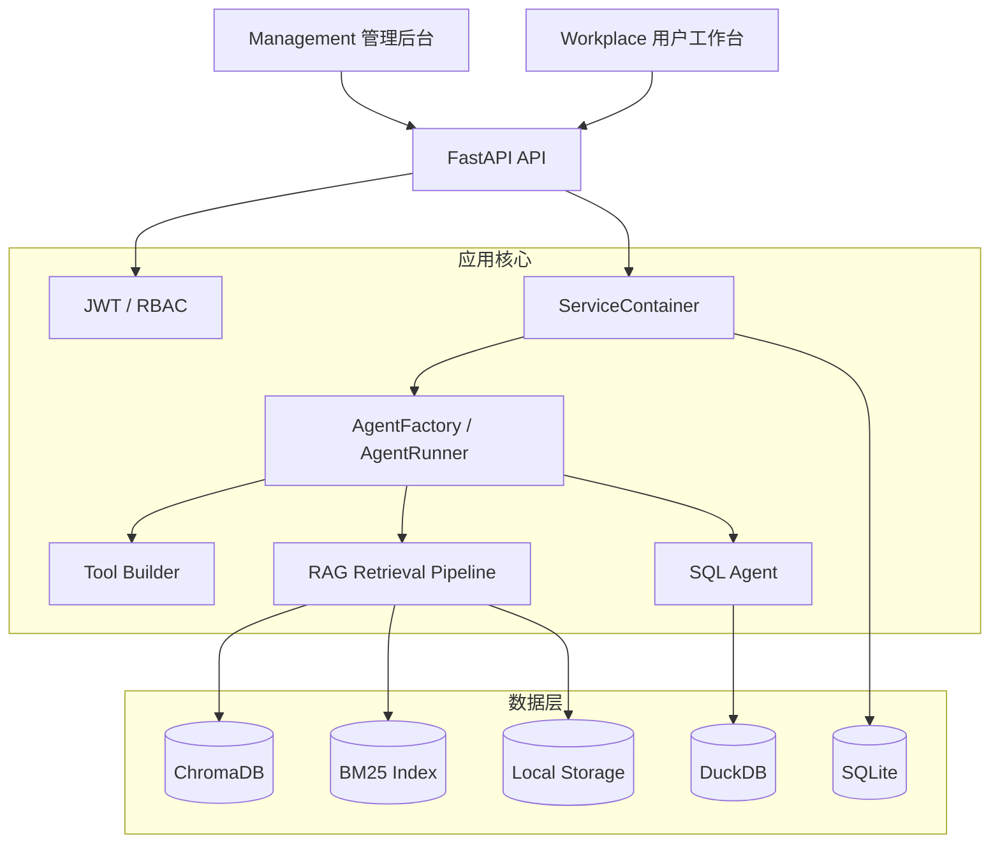

<div align="center">
  

# MiniAgent

面向个人与小团队的轻量级智能体平台

**简单架构 · 显式代码 · 易于部署 · 方便扩展**


[License](LICENSE) · [API 文档（本地启动后）](http://localhost:10088/docs)

</div>

> [!IMPORTANT]
> MiniAgent 当前处于开发阶段，数据库结构和接口仍可能调整。升级前请备份 `backend/db` 与 `backend/files`。

## 项目简介

MiniAgent 提供从模型配置、知识库构建、智能体编排到最终用户对话的完整工作流。项目包含 FastAPI 后端、PureAdmin 管理后台和独立的 Workplace 用户工作台，适合用于搭建企业知识助手、内部数据助手、法律顾问以及其他垂直领域智能体。

## 核心功能

### 智能体与模型

- 创建和管理多个智能体，配置系统提示词、LLM 与工具
- 支持 OpenAI 兼容接口、Ollama 等模型服务
- 管理 LLM、Embedding、工具、领域插件与路由策略
- 基于用户—智能体授权关系控制智能体使用范围
- 支持同步调用与 SSE 流式响应

### RAG 知识库

- 管理多个知识库、文档与切片
- 支持 PDF、Word、文本、表格等常见文档格式
- ChromaDB 向量检索与 BM25 关键词检索
- 支持 RRF 融合、阈值过滤、可选重排与 Small-to-Big 检索
- 支持多知识库智能路由及领域处理插件

### SQL 与工具能力

- 使用 DuckDB 分析 CSV、Excel 等结构化数据
- SQL Agent 支持数据查询、统计分析与图表数据生成
- 可扩展工具系统与 Web Search 能力
- 智能体运行时工具缓存及配置失效机制

### 权限与运维

- JWT 登录、Access Token 自动刷新与 RBAC 权限控制
- 密码复杂度校验和登录失败锁定
- 管理员可解除用户锁定并维护用户智能体授权
- 登录日志、审计日志与系统配置管理
- API、SQLite、DuckDB 和硬件资源状态监控

### 双前端

- **Management**：基于 PureAdmin 的系统管理后台
- **Workplace**：面向最终用户的智能体工作台
  - 登录、自动刷新 Token、退出登录
  - 中文 `zh_CN` 与英文 `en_US`
  - 多套主题色调
  - 选择授权智能体
  - 查询、查看、重命名和删除会话
  - Markdown 消息及 SSE 流式对话

## 系统架构



后端采用清晰的分层结构：

- `app/api/`：HTTP 路由、依赖注入与请求响应转换
- `app/services/`：业务逻辑
- `app/runtime/`：智能体、会话、LLM、检索等运行时组件
- `app/repositories/`：异步数据库访问
- `app/schemas/`：Pydantic 数据模型
- `app/infra/`：数据库模型、缓存、初始化与基础设施

## 技术栈

| 模块       | 技术                                                |
| ---------- | --------------------------------------------------- |
| 后端       | Python、FastAPI、Pydantic、SQLAlchemy Async、Loguru |
| 智能体     | LangChain、LangGraph、自定义 Agent Runtime          |
| 管理后台   | Vue 3、TypeScript、PureAdmin、Element Plus、Pinia   |
| 用户工作台 | Vue 3、TypeScript、Vite、Element Plus、Vue I18n     |
| 业务数据库 | SQLite                                              |
| 分析数据库 | DuckDB                                              |
| 向量数据库 | ChromaDB                                            |
| 检索       | Vector Search、BM25、RRF、Reranker                  |

## 目录结构

```text
miniagent/
├── backend/                  # FastAPI 后端
│   ├── app/
│   │   ├── api/              # Admin、User、Auth、运维接口
│   │   ├── core/             # 配置、安全、依赖注入、i18n
│   │   ├── infra/            # ORM、数据库初始化、缓存
│   │   ├── repositories/     # 异步数据访问层
│   │   ├── runtime/          # Agent、LLM、会话与运行时组件
│   │   ├── schemas/          # Pydantic DTO
│   │   └── services/         # 业务服务
│   ├── db/                   # 本地数据库与索引（运行时生成）
│   ├── files/                # 上传文件（运行时生成）
│   ├── .env.example          # 环境变量模板
│   └── requirements.txt
├── management/               # PureAdmin 管理后台
├── workplace/                # 最终用户工作台
├── docker-compose.yml
├── setup.bat
├── setup.sh
└── README.md
```

## 环境要求

- Python 3.12 或更高版本
- Node.js 20.19+ 或 22.13+
- pnpm 9 或更高版本
- 可用的 LLM 服务，例如 Ollama 或 OpenAI 兼容接口
- 可选：NVIDIA GPU 与对应驱动

## 快速开始

### 1. 获取代码

```bash
git clone <your-repository-url>
cd miniagent
```

### 2. 配置并启动后端

Windows PowerShell：

```powershell
Set-Location backend
py -m venv .venv
.\.venv\Scripts\Activate.ps1
python -m pip install --upgrade pip
python -m pip install -r requirements.txt
Copy-Item .env.example .env
```

Linux/macOS：

```bash
cd backend
python3 -m venv .venv
source .venv/bin/activate
python -m pip install --upgrade pip
python -m pip install -r requirements.txt
cp .env.example .env
```

打开 `backend/.env`，至少修改 JWT 密钥，并配置实际使用的模型服务。然后启动 API：

```bash
python -m uvicorn app.main:app --reload --host 0.0.0.0 --port 10088
```

应用首次启动时会自动创建数据库并载入种子数据。

### 3. 启动管理后台

打开一个新终端：

```bash
cd management
pnpm install
pnpm dev
```

默认地址：<http://localhost:8848>

### 4. 启动 Workplace

再打开一个新终端：

```bash
cd workplace
pnpm install
pnpm dev
```

Workplace 使用 Vite 开发服务器，访问地址以终端输出为准。

> [!TIP]
> `pnpm` 必须在 `management` 或 `workplace` 目录中运行。`backend` 是 Python 项目，其中没有 `package.json`。

## 默认开发账号

| 用途               | 用户名  | 密码       |
| ------------------ | ------- | ---------- |
| 管理员             | `admin` | `1FaFkWt9` |
| Workplace 演示用户 | `demo`  | `fIzF7JHK` |

演示用户默认被授权使用 `law_assistant`。

> [!WARNING]
> 默认账号仅用于本地开发。部署到共享环境或生产环境前，必须修改密码、替换 `JWT_SECRET_KEY` 并检查用户授权。

## 常用地址

启动默认开发环境后：

| 服务       | 地址                            |
| ---------- | ------------------------------- |
| FastAPI    | <http://localhost:10088>        |
| Swagger UI | <http://localhost:10088/docs>   |
| ReDoc      | <http://localhost:10088/redoc>  |
| 健康检查   | <http://localhost:10088/health> |
| Management | <http://localhost:8848>         |
| Workplace  | 以 Vite 终端输出为准            |

## 关键配置

后端配置位于 `backend/.env`，完整字段参见 `backend/.env.example`。

```dotenv
APP_NAME=MiniAgent
APP_VERSION=0.1.0
DEBUG=True
ENVIRONMENT=development

API_HOST=0.0.0.0
API_PORT=10088

SQLITE_DB_PATH=db/sqlite
DUCK_DB_PATH=db/duckdb
VECTOR_DB_PATH=db/vector
STORAGE_DIR=files

JWT_SECRET_KEY=replace-with-a-long-random-secret
ACCESS_TOKEN_EXPIRE_DAYS=1
REFRESH_TOKEN_EXPIRE_DAYS=7

PASSWORD_MIN_LENGTH=8
PASSWORD_REQUIRE_UPPER=true
PASSWORD_REQUIRE_LOWER=true
PASSWORD_REQUIRE_DIGIT=true
PASSWORD_REQUIRE_SPECIAL=false

LOGIN_MAX_FAILED_ATTEMPTS=5
LOGIN_LOCK_DURATION_MINUTES=10
```

前端开发代理默认指向 `http://127.0.0.1:10088`。Workplace 可通过启动前设置 `VITE_PROXY_TARGET` 临时切换后端地址。

PowerShell 示例：

```powershell
$env:VITE_PROXY_TARGET="http://127.0.0.1:10089"
pnpm dev
```

## 构建与测试

后端测试：

```bash
cd backend
python -m pytest app/test
```

构建管理后台：

```bash
cd management
pnpm build
```

检查并构建 Workplace：

```bash
cd workplace
pnpm build
```

部分检索、LLM 和 SQL Agent 测试需要模型服务及测试数据，请根据测试文件中的说明准备环境。

## 数据与缓存

- SQLite、DuckDB、ChromaDB、BM25 索引和上传文件默认保存在 `backend` 下的本地目录中。
- 修改智能体、知识库、工具或模型配置后，应通过对应服务执行缓存失效，避免继续使用旧配置。
- 不要把 `.env`、模型密钥、本地数据库、日志或用户上传文件提交到公开仓库。

## 生产部署建议

- 设置 `DEBUG=False` 和 `ENVIRONMENT=production`
- 使用高强度随机 `JWT_SECRET_KEY`
- 限制 `CORS_ORIGINS`，不要在生产环境使用通配来源
- 修改或移除默认账号
- 为 API 配置 HTTPS、反向代理、访问日志和备份策略
- 将模型密钥交给 Secret Manager 或部署平台的安全变量管理
- 持久化 `backend/db`、`backend/files` 与必要的索引目录
- 根据模型与文档处理负载配置 CPU、内存和 GPU 限额

## 常见问题

### `No package.json found in D:\miniagent\backend`

当前终端位于后端目录。请切换到目标前端目录：

```powershell
Set-Location D:\miniagent\workplace
pnpm install
pnpm dev
```

### Workplace 中没有可选择的智能体

登录管理后台，为用户配置智能体授权。Workplace 只展示 `UserAgentRelation` 中已授权且处于启用状态的智能体。

### 修改模型或智能体配置后没有立即生效

运行时组件使用对象缓存与值缓存。请通过管理后台保存配置，并确认对应服务已执行缓存失效；必要时重启后端。

### 本地模型无法响应

确认 Ollama 或其他模型服务已经启动，模型已下载，并且后台中的 Base URL、模型名称及 API Key 配置正确。

## 参与贡献

欢迎提交 Issue 和 Pull Request。建议在提交前完成：

1. 保持 API、Service、Repository 和 Schema 分层清晰。
2. 为新接口补充权限与资源归属校验。
3. 为新功能增加测试或提供可复现的验证步骤。
4. 确保前端类型检查和生产构建通过。
5. 不提交密钥、数据库、日志、模型文件或用户数据。

## License

本项目基于 [Apache License 2.0](LICENSE) 开源。

---

<div align="center">
  Make the simple things simple, and the complex things possible.
</div>
